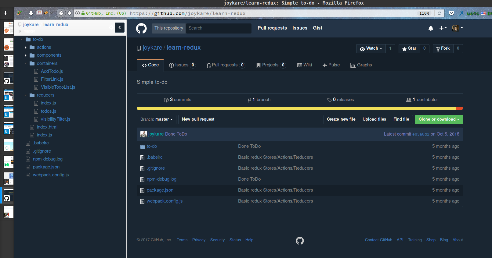

## Octotree for firefox styles.

I just tested this thing on firefox, since it was just plain

odd white on my [Github Dark
2.0]('https://userstyles.org/styles/128271/github-dark-2-0') styles.

## How it looks now.

Now it got a pretty blend with the overall styles.

I'm no css guru, I'll appreciate more contribution to make this

**blue thing** awesome again. ;) 

Peace Out!
